# DevOps-PodA-Jan2025-SHALI-Packer

# Introduction

In modern cloud computing, creating and maintaining custom machine images is crucial for ensuring consistency, security, and efficiency in infrastructure deployment. Packer, a powerful open-source tool by HashiCorp, simplifies the process of automating AMI (Amazon Machine Image) creation. This documentation provides a step-by-step guide on setting up a GitHub repository, installing Packer, configuring authentication, defining Packer templates, implementing security hardening scripts, and automating builds with GitHub Actions. By following this guide, users can build and manage AMIs efficiently, ensuring compliance with industry security standards.

# Technologies Used

The following technologies and tools are utilized in this project:

1. **GitHub -** For version control and repository management.

2. **Packer -** For creating custom Amazon Machine Images (AMIs).

3. **AWS (Amazon Web Services) -** For cloud infrastructure and AMI hosting.

4. **Git -** For repository cloning, committing, and pushing changes.

5. **Linux/Windows -** For executing commands and running Packer builds.

6. **Shell Scripting (Bash) -** For implementing security hardening configurations.

7. **GitHub Actions -** For automating Packer builds through a CI/CD pipeline.

8. **OIDC Authentication -** For securely granting GitHub Actions access to AWS resources.

# Step 1: Create a GitHub Repository

## Objective
Set up a GitHub repository to store the Packer configuration files for building and managing AMIs.

## Actions

1. Log into GitHub and navigate to GitHub New Repository.
1. Follow the naming convention (if necessary)
1. Set repository visibility: Choose Private or Public depending on your organization's requirements.
2. **Initialize with a README:**
   - Check the box to include a `README.md` file.

3. **Add a `.gitignore` file:**
   - Choose HashiCorp Packer to ignore unnecessary files.

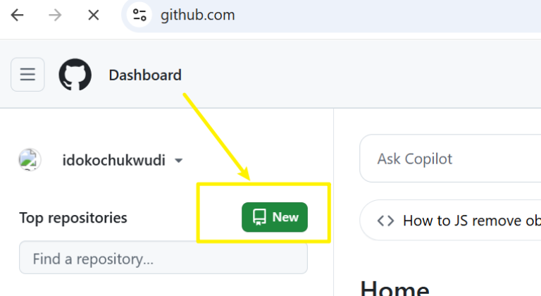


# Step 2: Clone the Repository Locally

## Objective

Work on the repository locally to create Packer configuration files.

## Actions

1. **Open a terminal** on your local machine.
2. **Clone the repository:**

```
git clone https://github.com/idokochukwudi/DevOps-PodA-Jan2025-SHALI-Packer.git
```
**To copy your repository URL:**

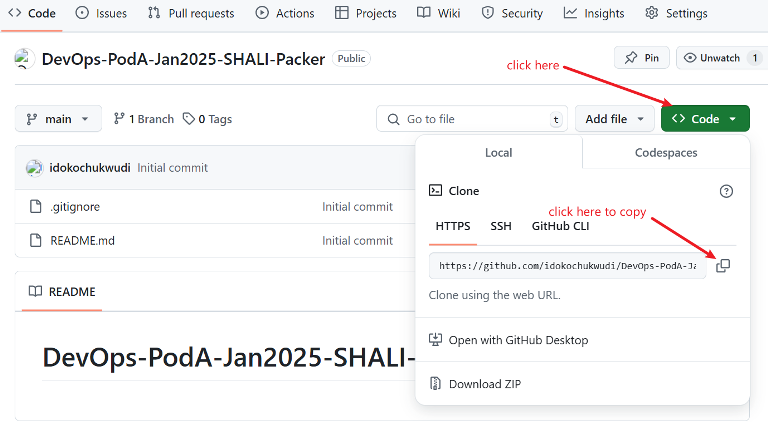

- Go to the directory where you want to store your cloned repository.
- **Open terminal and clone the repository**


# Step 3: Install Packer

## Objective

Ensure Packer is installed for AMI creation.

## Actions

1. **Check if Packer is installed:**
   
   Run:

   ```
   packer --version
   ```

2. **If not installed, install Packer:**
   
- **For Linux/macOS:**

    Run:

    ```
    curl -fsSL https://apt.releases.hashicorp.com/gpg | sudo apt-key add -
    sudo apt-add-repository "deb [arch=amd64] https://apt.releases.hashicorp.com $(lsb_release -cs) main"
    sudo apt-get update && sudo apt-get install packer
    ```

- **For Windows:**
1. Download from Packer Website.
   
    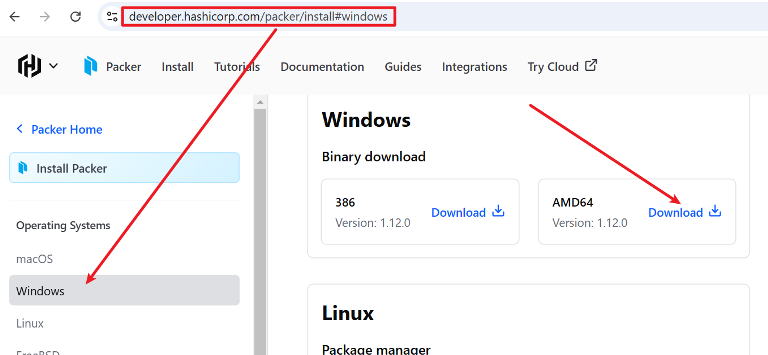

2. Extract the downloaded file to a directory (e.g., C:\Program Files\packer).

    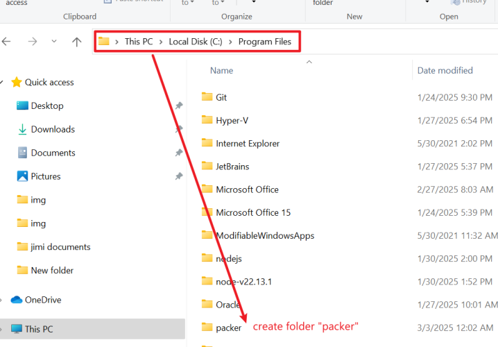

3. Add Packer to the system PATH.

- Search for Environment Variables in Windows.
  
  

- Under **System Variable**s, find `Path`, and click `Edit`.

    

    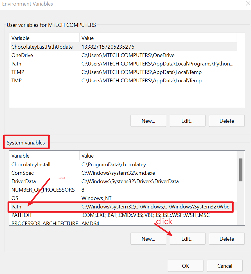

- Click **New** and add the path to the extracted folder (e.g., C:\Program Files\packer).

    
    
  
4. **Verify Installation**

    Open **Command Prompt** `(cmd)` or `PowerShell` and **run**:

    ```
    packer --version
    ```

    


# Step 4: Set Up OIDC Authentication

**OpenID Connect (OIDC)** allows GitHub Actions to assume an IAM role without storing AWS credentials.

You can access the step-by-step guide for setting up OIDC authentication through this link: https://tinyurl.com/45sfj8zt


# Step 5: Create the Packer Template File

## Objective

Define the Packer configuration (.pkr.hcl) for building the AMI.

## Actions

1. **Create a new file:**

    Run:
    ```
    touch ami-template.pkr.hcl
    ```
    

2. **Open it in a text editor** and add the following configuration:

```
packer {
  required_plugins {
    amazon = {
      source  = "github.com/hashicorp/amazon"
      version = ">= 1.0.0"
    }
  }
}

source "amazon-ebs" "shali" {
  region      = "us-east-1"
  source_ami  = "ami-0e1bed4f06a3b463d" # Replace with a valid Ubuntu 22.04 AMI ID
  instance_type = "t2.micro"

  communicator = "ssh"
  ssh_username = "ubuntu"
}

build {
  sources = ["source.amazon-ebs.shali"]

  provisioner "shell" {
    script = "001-critical-standards.sh"
  }

  provisioner "shell" {
    script = "002-non-critical-standards.sh"
  }
}
```

1. **Save the file.**


# Step 5: Validate and Format the Packer Configuration

## Objective

Ensure the template is correctly formatted and syntactically correct.

## Actions

1. **Run format check:**

    ```
    packer fmt ami-template.pkr.hcl
    ```

    

2. **Validate the configuration:**

```
packer validate ami-template.pkr.hcl
```

## ERROR


The error message indicates that `ami_name` is missing, and Packer requires it to be between 3 and 128 characters long. You need to add the `ami_name` parameter to your `amazon-ebs `block.

## Fixed Code

Add `ami_name` inside your `amazon-ebs` `source` block:

```
# Defines the Packer configuration block and specifies required plugins
packer {
  required_plugins {
    amazon = {
      source  = "github.com/hashicorp/amazon" # Specifies the source of the Amazon plugin
      version = ">= 1.0.0" # Ensures compatibility with Packer versions 1.0.0 and above
    }
  }
}

# Defines the Amazon Elastic Block Store (EBS)-backed AMI source
source "amazon-ebs" "shali" {
  region         = "us-east-1" # AWS region where the AMI will be created
  source_ami     = "ami-0e1bed4f06a3b463d" # Base AMI (Ubuntu 22.04), replace with a valid AMI ID
  instance_type  = "t2.micro" # Instance type used for building the image
  ssh_username   = "ubuntu" # SSH username for the base AMI
  communicator   = "ssh" # Specifies SSH as the communication method

  ami_name       = "packer-ubuntu-ami-{{timestamp}}" # Sets the AMI name with a timestamp
  ami_description = "Hardened AMI following CSI standards" # Provides a description for the AMI

  # Tags for identifying and organizing the AMI
  tags = {
    Name        = "shali-packer-image" # Name of the AMI
    Project     = "SHALI" # Project associated with the AMI
    Environment = "Dev" # Deployment environment (Development)
  }
}

# Build block to define provisioning steps
build {
  sources = ["source.amazon-ebs.shali"] # Uses the Amazon EBS source defined above

  # Executes a shell script for applying critical security standards
  provisioner "shell" {
    script = "scripts/001-critical-standards.sh" # Path to the shell script
  }

  # Executes a second shell script for non-critical configurations
  provisioner "shell" {
    script = "scripts/002-non-critical-standards.sh" # Path to the second script
  }
}
```

## What Was Fixed?

1. Added `ami_name` = `"packer-ubuntu-ami-{{timestamp}}"`

- This ensures a unique AMI name is generated.
- `{{timestamp}}` appends the current timestamp to the AMI name.

## Next Steps

1. **Save the updated file.**
2. **Re-run Packer validation:**

    ```
    packer validate ami-template.pkr.hcl
    ```

    


# Step 6: Add CIS Benchmark Hardening Scripts

## Objective

Apply security hardening scripts to meet CSI standards.

## Actions

1. **Create a directory for scripts:**

  ```
  mkdir scripts
  ```

  

2. **Create a script for critical standards** `(001-critical-standards.sh)`:

  ```
  touch scripts/001-critical-standards.sh
  ```

  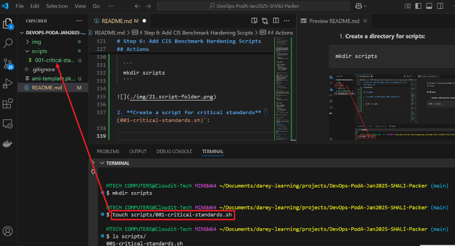

**Add the following content:**

  ```
  #!/bin/bash
  echo "Applying critical security configurations..."
  # Example: Disable root login
  sudo sed -i 's/^PermitRootLogin yes/PermitRootLogin no/' /etc/ssh/sshd_config
  sudo systemctl restart sshd
  ```

  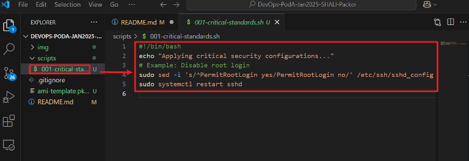

3. **Create a script for non-critical standards** `(002-non-critical-standards.sh)`:

  ```
  touch scripts/002-non-critical-standards.sh
  ```

  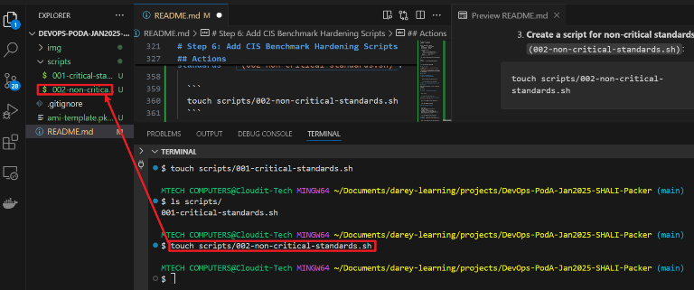

**Add the following content:**

  ```
  #!/bin/bash
  echo "Applying non-critical security configurations..."
  # Example: Set a banner message
  echo "Unauthorized access prohibited" | sudo tee /etc/motd
  ```

  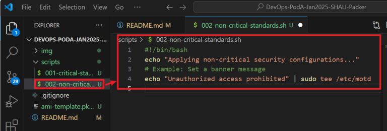

# Step 7: Configure GitHub Actions for CI/CD

## Objective

Automate Packer builds using GitHub Actions.

## Actions

1. **Create a workflow directory and file:**

  ```
  mkdir -p .github/workflows
  touch .github/workflows/packer-ci.yml
  ```

  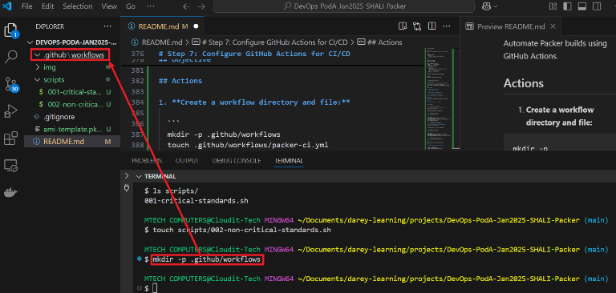

  

2. Define the GitHub Actions workflow `(packer-ci.yml)`:

```
# Workflow name: Build and Deploy Packer AMI
name: Build and Deploy Packer AMI

# Triggers the workflow on push and pull request events to the 'main' branch
on:
  push:
    branches:
      - main
  pull_request:
    branches:
      - main

# Defines required permissions for accessing OIDC and repository contents
permissions:
  id-token: write # Allows GitHub Actions to authenticate via OIDC for AWS
  contents: read  # Grants read access to repository contents

# Defines the job to build the AMI
jobs:
  build:
    runs-on: ubuntu-latest # Runs the job on the latest Ubuntu environment
    steps:
      - name: Checkout Repository
        uses: actions/checkout@v4 # Checks out the repository code

      - name: Install Packer
        uses: hashicorp/setup-packer@v2 # Installs Packer CLI
        with:
          version: latest # Installs the latest Packer version

      - name: Initialize Packer
        run: |
          echo "Running packer init to install required plugins..."
          packer init ami-template.pkr.hcl # Initializes Packer and installs required plugins
          echo "Checking installed plugins..."
          ls -R ~/.config/packer/plugins # Lists installed Packer plugins for debugging
          echo "Packer initialization completed."

      - name: Debug OIDC Token Sub Value
        run: |
          echo "Fetching OIDC Token..."
          TOKEN=$(curl -s -H "Authorization: Bearer $ACTIONS_ID_TOKEN_REQUEST_TOKEN" \
                  "$ACTIONS_ID_TOKEN_REQUEST_URL" | jq -r '.value') # Fetches OIDC token from GitHub Actions
          echo "Decoded OIDC Token Sub Value:"
          echo $TOKEN | jq -R 'split(".") | .[1] | @base64d | fromjson' | jq '.sub' # Decodes and extracts the 'sub' field
        env:
          ACTIONS_ID_TOKEN_REQUEST_TOKEN: ${{ secrets.GITHUB_TOKEN }} # Uses GitHub token for authentication
          ACTIONS_ID_TOKEN_REQUEST_URL: "https://token.actions.githubusercontent.com" # OIDC token request URL

      - name: Configure AWS Credentials via OIDC
        uses: aws-actions/configure-aws-credentials@v2 # Configures AWS credentials using OpenID Connect (OIDC)
        with:
          role-to-assume: ${{ secrets.AWS_ROLE_ARN }} # AWS IAM role to assume
          aws-region: us-east-1 # Sets AWS region to US East (N. Virginia)

      - name: Validate Packer Template
        run: |
          echo "Validating Packer Template..."
          packer validate ami-template.pkr.hcl # Validates the Packer template syntax
          echo "Validation Completed."

      - name: Build AMI
        run: |
          echo "Building AMI..."
          packer build ami-template.pkr.hcl # Runs Packer to build an AMI
          echo "Build Completed."
```

3. Commit and push
   
```
git add .
git commit -m "Initial Packer setup"
git push origin main
```

## WARNING


The **LF** to **CRLF** warning is because Git on Windows is set to automatically convert line endings. This can cause issues when running shell scripts on Linux-based AMIs in AWS.

## How to Fix It

**Convert the Files to LF (Unix Line Endings)**

Run the following command to manually convert them:

```
git config --global core.autocrlf false  # Disable automatic CRLF conversion
dos2unix scripts/001-critical-standards.sh scripts/002-non-critical-standards.sh
```


If dos2unix is not installed, you can use:

```
sed -i 's/\r$//' scripts/001-critical-standards.sh scripts/002-non-critical-standards.sh
```

**Verify the Line Endings**

Check the file format using:

```
file scripts/001-critical-standards.sh
file scripts/002-non-critical-standards.sh
```


This shows that I have successfully converted my scripts to LF format using dos2unix.

Now, when you run file `scripts/001-critical-standards.sh` and file `scripts/002-non-critical-standards.sh`, the output confirms that both are recognized as Bourne-Again shell scripts (ASCII text executable), which means they should now execute properly on Linux-based AMIs in AWS.

4. Re-Commit and push
   
```
git add .
git commit -m "Initial Packer setup"
git push origin main
```

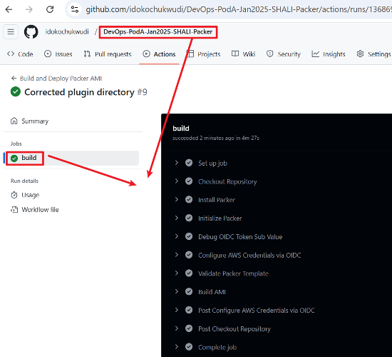

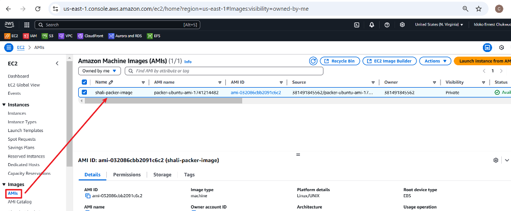

# Conclusion

By leveraging Packer and GitHub Actions, this project enables users to automate the creation and deployment of secure AMIs in AWS. The structured approach ensures that images adhere to security best practices, reducing manual effort while increasing efficiency. Implementing CIS benchmark hardening scripts further enhances security, making the AMIs production-ready. With this guide, teams can streamline their infrastructure provisioning, enforce standardization, and maintain a reliable cloud environment.