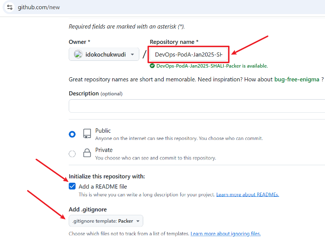
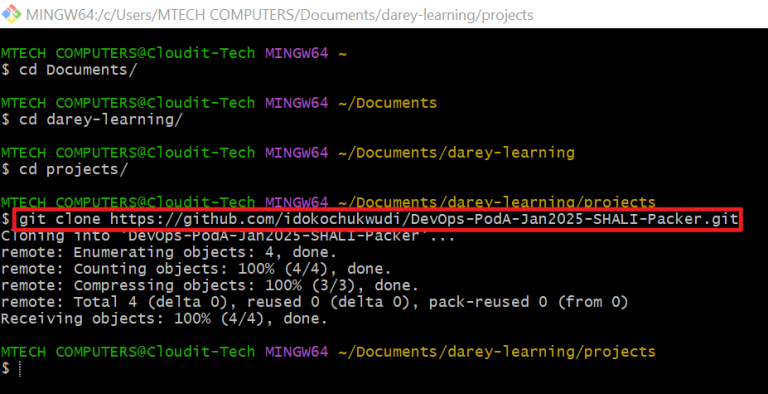
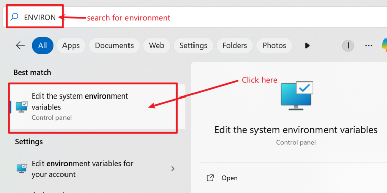
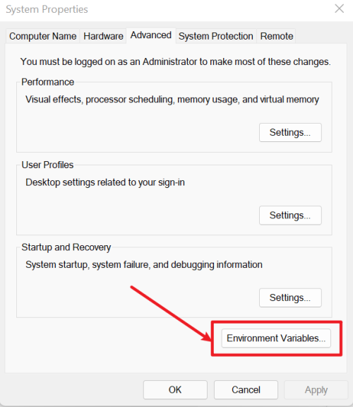
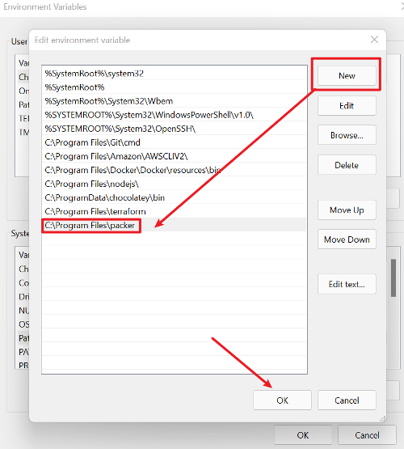
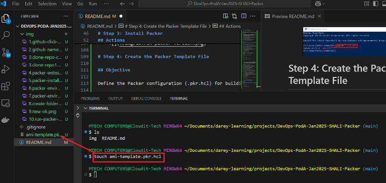
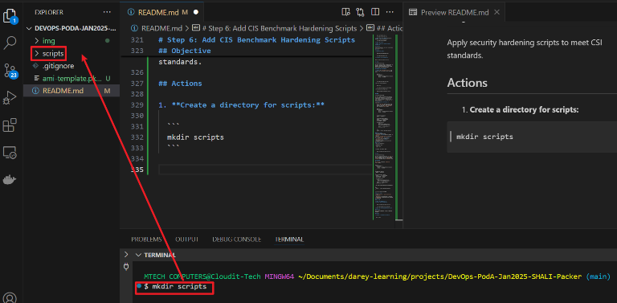

# DevOps-PodA-Jan2025-SHALI-Packer

# Step 1: Create a GitHub Repository

## Objective
Set up a GitHub repository to store the Packer configuration files for building and managing AMIs.

## Actions

1. Log into GitHub and navigate to GitHub New Repository.
1. Follow the naming convention (if necessary)
1. Set repository visibility: Choose Private or Public depending on your organization's requirements.
2. **Initialize with a README:**
   - Check the box to include a `README.md` file.

3. **Add a `.gitignore` file:**
   - Choose HashiCorp Packer to ignore unnecessary files.




# Step 2: Clone the Repository Locally

## Objective

Work on the repository locally to create Packer configuration files.

## Actions

1. **Open a terminal** on your local machine.
2. **Clone the repository:**

```
git clone https://github.com/idokochukwudi/DevOps-PodA-Jan2025-SHALI-Packer.git
```
**To copy your repository URL:**


- Go to the directory where you want to store your cloned repository.
- **Open terminal and clone the repository**



# Step 3: Install Packer

## Objective

Ensure Packer is installed for AMI creation.

## Actions

1. **Check if Packer is installed:**
   
   Run:

   ```
   packer --version
   ```

2. **If not installed, install Packer:**
   
- **Linux/macOS:**

    Run:

    ```
    curl -fsSL https://apt.releases.hashicorp.com/gpg | sudo apt-key add -
    sudo apt-add-repository "deb [arch=amd64] https://apt.releases.hashicorp.com $(lsb_release -cs) main"
    sudo apt-get update && sudo apt-get install packer
    ```

- **Windows:**
1. Download from Packer Website.
   
    

2. Extract the downloaded file to a directory (e.g., C:\Program Files\packer).

    

3. Add Packer to the system PATH.

- Search for Environment Variables in Windows.
  
  

- Under **System Variable**s, find `Path`, and click `Edit`.

    

    

- Click **New** and add the path to the extracted folder (e.g., C:\Program Files\packer).

    

4. Verify Installation

    Open **Command Prompt** `(cmd)` or `PowerShell` and **run**:

    ```
    packer --version
    ```

    


# Step 4: Set Up OIDC Authentication

OIDC allows GitHub Actions to assume an IAM role without storing AWS credentials.

You can access the step-by-step guide for setting up OIDC authentication through this link: https://tinyurl.com/45sfj8zt


# Step 5: Create the Packer Template File

## Objective

Define the Packer configuration (.pkr.hcl) for building the AMI.

## Actions

1. **Create a new file:**

    Run:
    ```
    touch ami-template.pkr.hcl
    ```
    

2. **Open it in a text editor** and add the following minimal configuration:

```
packer {
  required_plugins {
    amazon = {
      source  = "github.com/hashicorp/amazon"
      version = ">= 1.0.0"
    }
  }
}

source "amazon-ebs" "shali" {
  region      = "us-east-1"
  source_ami  = "ami-0e1bed4f06a3b463d" # Replace with a valid Ubuntu 22.04 AMI ID
  instance_type = "t2.micro"

  communicator = "ssh"
  ssh_username = "ubuntu"
}

build {
  sources = ["source.amazon-ebs.shali"]

  provisioner "shell" {
    script = "001-critical-standards.sh"
  }

  provisioner "shell" {
    script = "002-non-critical-standards.sh"
  }
}
```


1. **Save the file.**

# Step 5: Validate and Format the Packer Configuration

## Objective

Ensure the template is correctly formatted and syntactically correct.

## Actions

1. **Run format check:**

    ```
    packer fmt ami-template.pkr.hcl
    ```

    

2. **Validate the configuration:**

```
packer validate ami-template.pkr.hcl
```

## ERROR


The error message indicates that `ami_name` is missing, and Packer requires it to be between 3 and 128 characters long. You need to add the `ami_name` parameter to your `amazon-ebs `block.

## Fixed Code

Add `ami_name` inside your `amazon-ebs` `source` block:

```
packer {
  required_plugins {
    amazon = {
      source  = "github.com/hashicorp/amazon"
      version = ">= 1.0.0"
    }
  }
}

source "amazon-ebs" "shali" {
  region         = "us-east-1"
  source_ami     = "ami-0e1bed4f06a3b463d" # Replace with a valid Ubuntu 22.04 AMI ID
  instance_type  = "t2.micro"
  ssh_username   = "ubuntu"
  communicator   = "ssh"

  ami_name       = "packer-ubuntu-ami-{{timestamp}}"
  ami_description = "Hardened AMI following CSI standards"

  tags = {
    Name        = "shali-packer-image"
    Project     = "SHALI"
    Environment = "Dev"
  }
}

build {
  sources = ["source.amazon-ebs.shali"]

  provisioner "shell" {
  script = "scripts/001-critical-standards.sh"
}

provisioner "shell" {
  script = "scripts/002-non-critical-standards.sh"
}
}
```

## What Was Fixed?

1. Added `ami_name` = `"packer-ubuntu-ami-{{timestamp}}"`

- This ensures a unique AMI name is generated.
- `{{timestamp}}` appends the current timestamp to the AMI name.

## Next Steps

1. **Save the updated file.**
2. **Re-run Packer validation:**

    ```
    packer validate ami-template.pkr.hcl
    ```

    


# Step 6: Add CIS Benchmark Hardening Scripts

## Objective

Apply security hardening scripts to meet CSI standards.

## Actions

1. **Create a directory for scripts:**

  ```
  mkdir scripts
  ```

  

2. **Create a script for critical standards** `(001-critical-standards.sh)`:

  ```
  touch scripts/001-critical-standards.sh
  ```

  

**Add the following content:**

  ```
  #!/bin/bash
  echo "Applying critical security configurations..."
  # Example: Disable root login
  sudo sed -i 's/^PermitRootLogin yes/PermitRootLogin no/' /etc/ssh/sshd_config
  sudo systemctl restart sshd
  ```

  

3. **Create a script for non-critical standards** `(002-non-critical-standards.sh)`:

  ```
  touch scripts/002-non-critical-standards.sh
  ```

  

**Add the following content:**

  ```
  #!/bin/bash
  echo "Applying non-critical security configurations..."
  # Example: Set a banner message
  echo "Unauthorized access prohibited" | sudo tee /etc/motd
  ```

  

# Step 7: Configure GitHub Actions for CI/CD

## Objective

Automate Packer builds using GitHub Actions.

## Actions

1. **Create a workflow directory and file:**

  ```
  mkdir -p .github/workflows
  touch .github/workflows/packer-ci.yml
  ```

  

  

2. Define the GitHub Actions workflow `(packer-ci.yml)`:

```
name: Build and Deploy Packer AMI

on:
  push:
    branches:
      - main
  pull_request:
    branches:
      - main

permissions:
  id-token: write
  contents: read

jobs:
  build:
    runs-on: ubuntu-latest
    steps:
      - name: Checkout Repository
        uses: actions/checkout@v4

      - name: Install Packer
        uses: hashicorp/setup-packer@v2
        with:
          version: latest

      - name: Configure AWS Credentials via OIDC
        uses: aws-actions/configure-aws-credentials@v2
        with:
          role-to-assume: ${{ secrets.AWS_ROLE_ARN }}
          aws-region: us-east-1

      - name: Validate Packer Template
        run: packer validate ami-template.pkr.hcl

      - name: Build AMI
        run: packer build ami-template.pkr.hcl
```
3. Commit and push
   
```
git add .
git commit -m "Initial Packer setup"
git push origin main
```

## WARNING


The **LF** to **CRLF** warning is because Git on Windows is set to automatically convert line endings. This can cause issues when running shell scripts on Linux-based AMIs in AWS.

## How to Fix It

**Convert the Files to LF (Unix Line Endings)**

Run the following command to manually convert them:

```
git config --global core.autocrlf false  # Disable automatic CRLF conversion
dos2unix scripts/001-critical-standards.sh scripts/002-non-critical-standards.sh
```


If dos2unix is not installed, you can use:

```
sed -i 's/\r$//' scripts/001-critical-standards.sh scripts/002-non-critical-standards.sh
```

**Verify the Line Endings**

Check the file format using:

```
file scripts/001-critical-standards.sh
file scripts/002-non-critical-standards.sh
```


